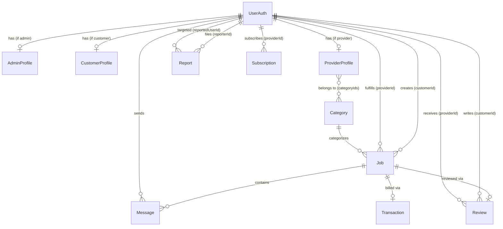

# LebanonConnect — Data Models Reference

> Auto-generated from `backend/Models/*.js`

---

## 1. UserAuth

**Collection:** `userauths` — Central authentication record for every user.

| Attribute | Type | Constraints | Default |
|---|---|---|---|
| `email` | String | **required**, unique, lowercase, trim | — |
| `passwordHash` | String | **required** | — |
| `role` | String | enum: `customer`, `provider`, `admin` — **required** | `"customer"` |
| `status` | String | enum: `active`, `suspended`, `deleted` | `"active"` |
| `lastLoginAt` | Date | | `null` |
| `createdAt` | Date | *auto (timestamps)* | — |
| `updatedAt` | Date | *auto (timestamps)* | — |

**Indexes:** `{ role, status }`

---

## 2. AdminProfile

**Collection:** `adminprofiles` — Extended profile for admin users.

| Attribute | Type | Constraints | Default |
|---|---|---|---|
| `userId` | ObjectId → `UserAuth` | **required**, unique | — |
| `permissions` | [String] | | `[]` |
| `createdAt` | Date | *auto (timestamps)* | — |
| `updatedAt` | Date | *auto (timestamps)* | — |

**Indexes:** `{ userId }` (unique)

---

## 3. CustomerProfile

**Collection:** `customerprofiles` — Extended profile for customer users.

| Attribute | Type | Constraints | Default |
|---|---|---|---|
| `userId` | ObjectId → `UserAuth` | **required**, unique | — |
| `fullName` | String | **required**, trim | — |
| `city` | String | trim | `""` |
| `addressArea` | String | trim | `""` |
| `createdAt` | Date | *auto (timestamps)* | — |
| `updatedAt` | Date | *auto (timestamps)* | — |

**Indexes:** `{ city }`

---

## 4. ProviderProfile

**Collection:** `providerprofiles` — Extended profile for service providers.

| Attribute | Type | Constraints | Default |
|---|---|---|---|
| `userId` | ObjectId → `UserAuth` | **required**, unique | — |
| `displayName` | String | **required**, trim | — |
| `bio` | String | trim | `""` |
| `city` | String | **required**, trim | — |
| `addressArea` | String | trim | `""` |
| `pricingType` | String | enum: `fixed`, `hourly`, `quote` | `"quote"` |
| `basePrice` | Number | | `0` |
| `isVerified` | Boolean | | `false` |
| `isActive` | Boolean | | `true` |
| `ratingAvg` | Number | cached aggregate | `0` |
| `ratingCount` | Number | cached aggregate | `0` |
| `completedJobsCount` | Number | cached aggregate | `0` |
| `subscription.plan` | String | enum: `free`, `basic`, `pro` | `"free"` |
| `subscription.expiresAt` | Date | | `null` |
| `subscription.trialUsed` | Boolean | | `false` |
| `onboardingComplete` | Boolean | | `false` |
| `categoryIds` | [ObjectId → `Category`] | | `[]` |
| `strike` | Number | min: 0, max: 3 | `0` |
| `createdAt` | Date | *auto (timestamps)* | — |
| `updatedAt` | Date | *auto (timestamps)* | — |

**Indexes:**
- `{ city, isActive, isVerified, ratingAvg }` — provider discovery
- `{ categoryIds, city, isActive }` — category-based search
- `{ isVerified, completedJobsCount }` — verified provider sorting
- `{ onboardingComplete }`, `{ subscription.plan }`, `{ subscription.expiresAt }`

---

## 5. Category

**Collection:** `categories` — Service categories that providers can belong to.

| Attribute | Type | Constraints | Default |
|---|---|---|---|
| `name` | String | **required**, unique, trim | — |
| `slug` | String | **required**, unique, lowercase, trim | — |
| `isActive` | Boolean | | `true` |
| `createdAt` | Date | *auto (timestamps)* | — |
| `updatedAt` | Date | *auto (timestamps)* | — |

---

## 6. Job

**Collection:** `jobs` — A service request from a customer to a provider.

| Attribute | Type | Constraints | Default |
|---|---|---|---|
| `customerId` | ObjectId → `UserAuth` | **required** | — |
| `providerId` | ObjectId → `UserAuth` | **required** | — |
| `categoryId` | ObjectId → `Category` | **required** | — |
| `title` | String | **required**, trim | — |
| `description` | String | trim | `""` |
| `city` | String | **required**, trim | — |
| `addressArea` | String | trim | `""` |
| `status` | String | enum: `open`, `accepted`, `in_progress`, `completed`, `confirmed`, `cancelled` | `"open"` |
| `acceptedAt` | Date | | — |
| `completedAt` | Date | | — |
| `confirmedAt` | Date | | — |
| `pricing.type` | String | enum: `fixed`, `hourly`, `quote` | `"quote"` |
| `pricing.amount` | Number | | `0` |
| `pricing.currency` | String | | `"USD"` |
| `pricing.quotedPrice` | Number | optional | `0` |
| `pricing.finalPrice` | Number | | `0` |
| `commission.percentage` | Number | | `10` |
| `commission.amount` | Number | | `0` |
| `commission.paid` | Boolean | | `false` |
| `createdAt` | Date | *auto (timestamps)* | — |
| `updatedAt` | Date | *auto (timestamps)* | — |

**Indexes:**
- `{ customerId, createdAt }` — customer dashboard
- `{ providerId, createdAt }` — provider dashboard
- `{ status, createdAt }` — admin feeds
- `{ categoryId, city, createdAt }` — job search

---

## 7. Message

**Collection:** `messages` — Chat messages within a job.

| Attribute | Type | Constraints | Default |
|---|---|---|---|
| `jobId` | ObjectId → `Job` | **required** | — |
| `senderId` | ObjectId → `UserAuth` | **required** | — |
| `content` | String | **required**, trim | — |
| `isBlocked` | Boolean | | `false` |
| `createdAt` | Date | *auto (timestamps)* | — |
| `updatedAt` | Date | *auto (timestamps)* | — |

**Indexes:**
- `{ jobId, createdAt }` — chat history
- `{ senderId, createdAt }` — moderation / audit

---

## 8. Review

**Collection:** `reviews` — Customer review of a provider after a job.

| Attribute | Type | Constraints | Default |
|---|---|---|---|
| `jobId` | ObjectId → `Job` | **required**, unique (one review per job) | — |
| `customerId` | ObjectId → `UserAuth` | **required** | — |
| `providerId` | ObjectId → `UserAuth` | **required** | — |
| `rating` | Number | **required**, min: 1, max: 5 | — |
| `text` | String | | `""` |
| `createdAt` | Date | *auto (timestamps)* | — |
| `updatedAt` | Date | *auto (timestamps)* | — |

**Indexes:**
- `{ jobId }` (unique)
- `{ providerId, createdAt }` — provider review listing

---

## 9. Report

**Collection:** `reports` — User-submitted reports for moderation.

| Attribute | Type | Constraints | Default |
|---|---|---|---|
| `reporterId` | ObjectId → `UserAuth` | **required** | — |
| `reportedUserId` | ObjectId → `UserAuth` | **required** | — |
| `jobId` | ObjectId → `Job` | optional | `null` |
| `type` | String | **required**, enum: `phone_share`, `scam`, `abuse`, `spam` | — |
| `details` | String | trim | `""` |
| `status` | String | enum: `open`, `reviewing`, `closed` | `"open"` |
| `createdAt` | Date | *auto (timestamps)* | — |
| `updatedAt` | Date | *auto (timestamps)* | — |

**Indexes:**
- `{ status, createdAt }` — admin report queue
- `{ reportedUserId, createdAt }` — per-user report history

---

## 10. Subscription

**Collection:** `subscriptions` — Provider subscription / billing records.

| Attribute | Type | Constraints | Default |
|---|---|---|---|
| `providerId` | ObjectId → `UserAuth` | **required** | — |
| `plan` | String | enum: `free`, `basic`, `pro` | `"free"` |
| `status` | String | enum: `trial`, `active`, `past_due`, `expired`, `canceled` | `"trial"` |
| `trialEndsAt` | Date | | `null` |
| `currentPeriodEnd` | Date | | `null` |
| `price` | Number | | `0` |
| `currency` | String | | `"USD"` |
| `visibilityBoost` | Boolean | | `false` |
| `createdAt` | Date | *auto (timestamps)* | — |
| `updatedAt` | Date | *auto (timestamps)* | — |

**Indexes:**
- `{ providerId, status }` — subscription lookup
- `{ status, currentPeriodEnd }` — renewal jobs

---

## 11. Transaction

**Collection:** `transactions` — Financial record of a completed job.

| Attribute | Type | Constraints | Default |
|---|---|---|---|
| `jobId` | ObjectId → `Job` | **required**, unique | — |
| `providerId` | ObjectId → `UserAuth` | **required** | — |
| `customerId` | ObjectId → `UserAuth` | **required** | — |
| `jobAmount` | Number | **required** | — |
| `commissionRate` | Number | **required** (e.g. `0.10`) | — |
| `commissionAmount` | Number | **required** | — |
| `status` | String | enum: `pending`, `paid`, `refunded` | `"pending"` |
| `createdAt` | Date | *auto (timestamps)* | — |
| `updatedAt` | Date | *auto (timestamps)* | — |

**Indexes:**
- `{ jobId }` (unique)
- `{ providerId, createdAt }` — provider transaction history
- `{ status, createdAt }` — admin financial overview

---

## Entity Relationship Diagram

